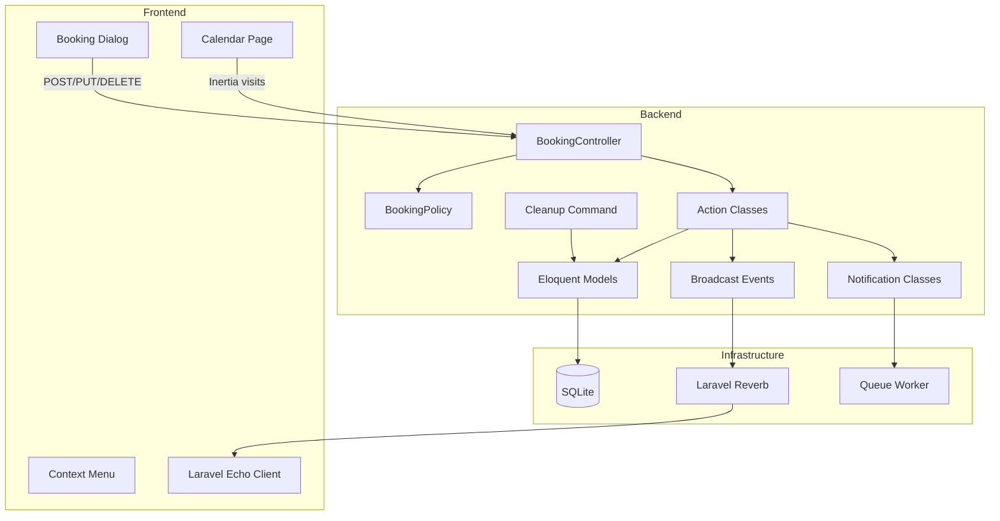
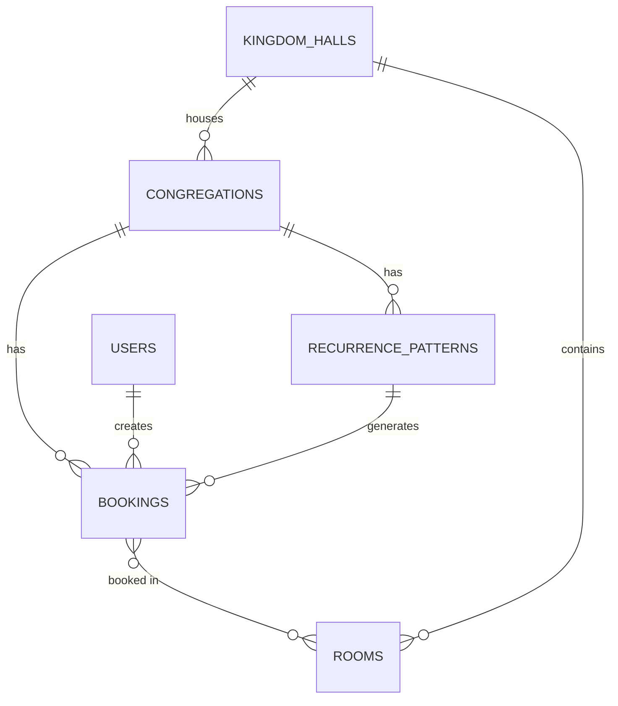

# Design Document: Booking System

## Overview

The booking system integrates room scheduling into the existing calendar application. It allows congregation members to create, view, edit, and delete room bookings with support for recurrence patterns, drag-and-drop rescheduling, real-time updates via WebSocket (Laravel Reverb), email notifications, and automated cleanup of expired data.

The system is scoped to the Kingdom Hall level — all congregations sharing a hall see each other's bookings — while authorization is role-scoped (Member → own bookings, Admin → congregation bookings, Superadmin → all bookings in the hall).

### Key Design Decisions

1. **Occurrence materialization**: Recurring bookings store individual occurrence rows in the database rather than computing them on the fly. This simplifies calendar queries, conflict detection, and partial deletion/editing of series.
2. **Pivot table for rooms**: A `booking_room` pivot enables multi-room bookings without duplicating the booking row.
3. **Single parent + exception pattern**: Recurrence uses a parent `recurrence_patterns` table. Editing "this occurrence only" creates an exception override on the occurrence row; editing "this and future" splits the pattern.
4. **Kingdom Hall–scoped broadcasting**: A single private channel per Kingdom Hall ensures all congregations in the hall receive real-time updates without cross-hall leakage.
5. **Action classes for business logic**: All mutation logic lives in single-purpose action classes, keeping controllers thin and enabling reuse from commands/jobs.

---

## Architecture



---

## Components and Interfaces

### Backend Components

| Component | Path | Responsibility |
|-----------|------|---------------|
| `BookingController` | `app/Http/Controllers/Congregations/BookingController.php` | CRUD endpoints, drag-and-drop reschedule |
| `BookingPolicy` | `app/Policies/BookingPolicy.php` | Role-based authorization gates |
| `CreateBooking` | `app/Actions/Bookings/CreateBooking.php` | Validates, creates booking + occurrences + pivot |
| `UpdateBooking` | `app/Actions/Bookings/UpdateBooking.php` | Edit single occurrence or split series |
| `DeleteBooking` | `app/Actions/Bookings/DeleteBooking.php` | Delete single/future/all with cascade logic |
| `RescheduleBooking` | `app/Actions/Bookings/RescheduleBooking.php` | Drag-and-drop time shift (preserves duration) |
| `TransferBookings` | `app/Actions/Bookings/TransferBookings.php` | Reassign future bookings on member removal |
| `Booking` | `app/Models/Booking.php` | Eloquent model for bookings |
| `BookingOccurrence` | `app/Models/BookingOccurrence.php` | Eloquent model for materialized occurrences |
| `RecurrencePattern` | `app/Models/RecurrencePattern.php` | Eloquent model for recurrence rules |
| `BookingCreated` | `app/Events/BookingCreated.php` | Broadcast event |
| `BookingUpdated` | `app/Events/BookingUpdated.php` | Broadcast event |
| `BookingDeleted` | `app/Events/BookingDeleted.php` | Broadcast event |
| `BookingModifiedNotification` | `app/Notifications/Bookings/BookingModifiedNotification.php` | Email to original booker on third-party edit |
| `BookingDeletedNotification` | `app/Notifications/Bookings/BookingDeletedNotification.php` | Email to original booker on third-party delete |
| `CleanupExpiredBookings` | `app/Console/Commands/CleanupExpiredBookings.php` | Daily scheduled command |

### Frontend Components

| Component | Path | Responsibility |
|-----------|------|---------------|
| `BookingDialog` | `resources/js/components/booking-dialog.tsx` | Create/edit form modal |
| `BookingContextMenu` | `resources/js/components/booking-context-menu.tsx` | Right-click/long-press detail + actions |
| `BookingBlock` | `resources/js/components/booking-block.tsx` | Visual booking chip for all views |
| `RecurrenceEditPrompt` | `resources/js/components/recurrence-edit-prompt.tsx` | "This only" / "This and future" dialog |
| `DeleteConfirmDialog` | `resources/js/components/delete-confirm-dialog.tsx` | Confirmation before deletion |
| `MemberRemovalDialog` | `resources/js/components/member-removal-dialog.tsx` | Transfer/delete prompt on member removal |
| `useBookingChannel` | `resources/js/hooks/use-booking-channel.ts` | Echo subscription for real-time updates |
| `useDragBooking` | `resources/js/hooks/use-drag-booking.ts` | Drag-and-drop state and snapping logic |

---

## Data Models

### Database Schema

#### `bookings` table

| Column | Type | Constraints |
|--------|------|-------------|
| `id` | `uuid` | Primary key |
| `congregation_id` | `foreignUuid` | FK → `congregations.id`, cascadeOnDelete |
| `user_id` | `foreignUuid` | FK → `users.id`, nullOnDelete |
| `name` | `string(255)` | NOT NULL |
| `starts_at` | `datetime` | NOT NULL |
| `ends_at` | `datetime` | NOT NULL |
| `recurrence_pattern_id` | `foreignUuid` | FK → `recurrence_patterns.id`, nullable, nullOnDelete |
| `is_exception` | `boolean` | DEFAULT false — marks single-occurrence overrides |
| `original_starts_at` | `datetime` | nullable — the original date this exception replaces |
| `created_at` | `timestamp` | |
| `updated_at` | `timestamp` | |

#### `booking_room` pivot table

| Column | Type | Constraints |
|--------|------|-------------|
| `id` | `uuid` | Primary key |
| `booking_id` | `foreignUuid` | FK → `bookings.id`, cascadeOnDelete |
| `room_id` | `foreignUuid` | FK → `rooms.id`, cascadeOnDelete |

Unique composite index on `(booking_id, room_id)`.

#### `recurrence_patterns` table

| Column | Type | Constraints |
|--------|------|-------------|
| `id` | `uuid` | Primary key |
| `congregation_id` | `foreignUuid` | FK → `congregations.id`, cascadeOnDelete |
| `frequency` | `string(10)` | Enum: daily, weekly, monthly, yearly |
| `end_date` | `date` | nullable — if end condition is a date |
| `end_count` | `integer` | nullable — if end condition is occurrence count |
| `created_at` | `timestamp` | |
| `updated_at` | `timestamp` | |

### Eloquent Models

#### `Booking`

```php
class Booking extends Model
{
    use HasFactory, HasUuids;

    protected $fillable = [
        'congregation_id', 'user_id', 'name',
        'starts_at', 'ends_at',
        'recurrence_pattern_id', 'is_exception', 'original_starts_at',
    ];

    protected function casts(): array
    {
        return [
            'starts_at' => 'datetime',
            'ends_at' => 'datetime',
            'original_starts_at' => 'datetime',
            'is_exception' => 'boolean',
        ];
    }

    public function congregation(): BelongsTo { ... }
    public function user(): BelongsTo { ... }
    public function recurrencePattern(): BelongsTo { ... }
    public function rooms(): BelongsToMany { ... }
}
```

#### `RecurrencePattern`

```php
class RecurrencePattern extends Model
{
    use HasFactory, HasUuids;

    protected $fillable = [
        'congregation_id', 'frequency', 'end_date', 'end_count',
    ];

    protected function casts(): array
    {
        return [
            'frequency' => RecurrenceFrequency::class,
            'end_date' => 'date',
            'end_count' => 'integer',
        ];
    }

    public function bookings(): HasMany { ... }
    public function congregation(): BelongsTo { ... }
}
```

#### `RecurrenceFrequency` Enum

```php
enum RecurrenceFrequency: string
{
    case Daily = 'daily';
    case Weekly = 'weekly';
    case Monthly = 'monthly';
    case Yearly = 'yearly';
}
```

### Relationships Diagram



### Controller Structure and API Endpoints

```
POST   /{congregation}/bookings              → BookingController@store
GET    /{congregation}/bookings              → BookingController@index (JSON for calendar data)
GET    /{congregation}/bookings/{booking}    → BookingController@show
PUT    /{congregation}/bookings/{booking}    → BookingController@update
PATCH  /{congregation}/bookings/{booking}/reschedule → BookingController@reschedule
DELETE /{congregation}/bookings/{booking}    → BookingController@destroy
```

All routes live under the `{current_congregation}` prefix with `auth`, `verified`, `EnsureCongregationMembership`, and `EnsureHasKingdomHall` middleware.

The `index` endpoint accepts query parameters for date range filtering (`from`, `to`) and returns bookings for the entire Kingdom Hall (not just the current congregation) to populate the calendar.

### BookingPolicy

```php
class BookingPolicy
{
    public function create(User $user, Congregation $congregation): bool
    {
        // Any member of the congregation can create bookings
        return $user->belongsToCongregation($congregation);
    }

    public function update(User $user, Booking $booking): bool
    {
        // Owner, Admin in same congregation, or Superadmin in same hall
        return $this->isOwner($user, $booking)
            || $this->isAdminOfBookingCongregation($user, $booking)
            || $this->isSuperadminInSameHall($user, $booking);
    }

    public function delete(User $user, Booking $booking): bool
    {
        // Same logic as update
        return $this->update($user, $booking);
    }
}
```

### Action Classes

| Action | Input | Output | Side Effects |
|--------|-------|--------|-------------|
| `CreateBooking` | Validated request data | `Booking` (with occurrences) | Broadcasts `BookingCreated`, conflict detection |
| `UpdateBooking` | Booking, edit scope, new data | `Booking` (updated) | Broadcasts `BookingUpdated`, notifies booker if third-party |
| `DeleteBooking` | Booking, delete scope | void | Broadcasts `BookingDeleted`, notifies booker if third-party |
| `RescheduleBooking` | Booking, new starts_at, scope | `Booking` | Broadcasts `BookingUpdated`, notifies booker if third-party |
| `TransferBookings` | Source user, target user, congregation | int (count transferred) | Updates `user_id` on future bookings |

### Conflict Detection

The `CreateBooking` and `UpdateBooking` actions check for overlapping bookings in the same room(s) and time range:

```sql
SELECT b.id FROM bookings b
JOIN booking_room br ON br.booking_id = b.id
WHERE br.room_id IN (?)
AND b.starts_at < :new_ends_at
AND b.ends_at > :new_starts_at
AND b.id != :exclude_id
```

---

## Broadcasting Events

All events implement `ShouldBroadcast` and broadcast on a private channel:

```php
private-kingdom-hall.{kingdomHallId}
```

### Channel Authorization (routes/channels.php)

```php
Broadcast::channel('kingdom-hall.{kingdomHallId}', function (User $user, string $kingdomHallId) {
    return $user->currentCongregation?->kingdom_hall_id === $kingdomHallId
        || $user->congregations()->where('kingdom_hall_id', $kingdomHallId)->exists();
});
```

### Event Payloads

**BookingCreated**: Full booking data (with rooms, congregation color, user name) + all occurrence data for recurring bookings.

**BookingUpdated**: Updated booking data + affected occurrence IDs.

**BookingDeleted**: Deleted booking ID(s) / occurrence ID(s).

All events use `$this->dontBroadcastToCurrentUser()` to prevent echoing back to the initiator.

---

## Email Notifications

### BookingModifiedNotification

Queued mail sent to the original booker when a higher-privilege user edits their booking:
- Booking name
- Old and new time range (formatted `yyyy-MM-dd HH:mm`, Europe/Stockholm)
- Old and new room list
- Name and role of the modifier
- Action timestamp

### BookingDeletedNotification

Same pattern as modification notification but includes the deleted booking's details.

Both implement `ShouldQueue` with `$tries = 3` and `$backoff = [10, 60, 300]` (exponential).

---

## Scheduled Cleanup

### `CleanupExpiredBookings` Command

Registered in `routes/console.php`:

```php
Schedule::command('bookings:cleanup')->daily();
```

Logic:
1. Delete all bookings (standalone or occurrences) where `ends_at < now()->subMonths(6)` (Europe/Stockholm timezone).
2. Delete any `recurrence_patterns` that have zero remaining bookings.
3. Log count of deleted bookings and patterns.
4. Idempotent: subsequent runs on the same day produce no deletions.

---

## Frontend Architecture

### BookingDialog

A shadcn `Dialog` component with:
- Name input (required, max 255)
- Date/time pickers with 15-minute interval snapping
- Room multi-select (checkboxes for available rooms)
- Recurrence toggle → frequency selector + end condition
- Congregation selector (visible only to Superadmins with multiple congregations)
- Form validation via `useForm` from Inertia

### Context Menu

Uses Radix `ContextMenu` primitive (desktop right-click) and a custom long-press hook for mobile. Shows booking details and conditionally renders Edit/Delete actions based on permissions passed from the server.

### Drag-and-Drop

Implemented with native HTML Drag API (`draggable`, `onDragStart`, `onDragOver`, `onDrop`):
- `useDragBooking` hook manages ghost element positioning, snap-to-grid (15-min intervals), and optimistic revert on conflict.
- Dragging is disabled (via `draggable={false}`) for bookings the user cannot edit (determined by `canEdit` prop from server).

### Inertia Page Props

The calendar page receives bookings via an Inertia endpoint. Bookings for the visible range are fetched lazily:

```typescript
type BookingResource = {
    id: string;
    name: string;
    starts_at: string; // ISO 8601
    ends_at: string;
    congregation_id: string;
    congregation_color: string | null;
    congregation_name: string;
    user_id: string;
    user_name: string;
    rooms: { id: string; name: string }[];
    recurrence_pattern_id: string | null;
    recurrence_summary: string | null; // e.g. "Weekly until 2025-12-31"
    is_exception: boolean;
    can_edit: boolean;
    can_delete: boolean;
};
```

The `can_edit` and `can_delete` fields are computed server-side via the policy so the frontend doesn't need to re-derive authorization logic.

### Laravel Echo Channel Subscription

```typescript
// hooks/use-booking-channel.ts
import Echo from 'laravel-echo';

export function useBookingChannel(kingdomHallId: string | undefined, handlers: BookingEventHandlers) {
    useEffect(() => {
        if (!kingdomHallId) return;

        const channel = window.Echo.private(`kingdom-hall.${kingdomHallId}`);

        channel
            .listen('.booking.created', handlers.onCreated)
            .listen('.booking.updated', handlers.onUpdated)
            .listen('.booking.deleted', handlers.onDeleted);

        return () => {
            window.Echo.leave(`kingdom-hall.${kingdomHallId}`);
        };
    }, [kingdomHallId]);
}
```

The hook is consumed in the calendar page. Event handlers merge/remove bookings from local React state without a full Inertia reload.

---

## Correctness Properties

*A property is a characteristic or behavior that should hold true across all valid executions of a system — essentially, a formal statement about what the system should do. Properties serve as the bridge between human-readable specifications and machine-verifiable correctness guarantees.*

### Property 1: Booking time constraint invariant

*For any* booking, the `ends_at` timestamp SHALL always be strictly after the `starts_at` timestamp, and both SHALL be aligned to 15-minute boundaries.

**Validates: Requirements 1.3, 1.7**

### Property 2: Room conflict exclusivity

*For any* two bookings that share at least one room, their time ranges SHALL NOT overlap (i.e., `booking_a.starts_at >= booking_b.ends_at` OR `booking_a.ends_at <= booking_b.starts_at`).

**Validates: Requirements 2.5, 6.5, 8.5, 9.7**

### Property 3: Recurrence occurrence count limit

*For any* recurrence pattern, the number of generated bookings (occurrences) SHALL be at most 365.

**Validates: Requirements 2.6**

### Property 4: Authorization hierarchy enforcement

*For any* booking and user, edit/delete permission SHALL be granted if and only if the user is the booking's creator, OR has Admin role in the booking's congregation, OR has Superadmin role in any congregation sharing the same Kingdom Hall.

**Validates: Requirements 6.1, 6.2, 6.3, 6.4, 7.1, 7.2, 7.3, 7.4, 7.5**

### Property 5: Edit scope isolation — "this occurrence only"

*For any* recurring booking series, editing a single occurrence SHALL modify only that occurrence's data and SHALL leave the parent recurrence pattern and all other occurrences unchanged.

**Validates: Requirements 8.2**

### Property 6: Edit scope split — "this and all future"

*For any* recurring booking series, editing "this and all future occurrences" SHALL end the original pattern before the edit point, create a new pattern from the edit point forward, and regenerate only future occurrences from the new pattern.

**Validates: Requirements 8.3, 8.4**

### Property 7: Drag-and-drop duration preservation

*For any* booking reschedule via drag-and-drop, the booking's duration (ends_at - starts_at) SHALL remain identical before and after the operation.

**Validates: Requirements 9.2**

### Property 8: Cascade deletion completeness

*For any* congregation deletion, zero bookings and zero recurrence patterns referencing that congregation's ID SHALL exist after the transaction completes.

**Validates: Requirements 11.1, 11.2, 11.3**

### Property 9: Notification dispatch correctness

*For any* booking modification or deletion performed by a user who is NOT the original booker, exactly one notification email SHALL be dispatched to the original booker. Conversely, when the booker modifies their own booking, zero notification emails SHALL be dispatched.

**Validates: Requirements 13.1, 13.2, 13.3, 13.4, 13.5**

### Property 10: Cleanup idempotence

*For any* set of bookings, running the cleanup command twice on the same day SHALL produce the same final state — the second run SHALL delete zero additional records.

**Validates: Requirements 16.6**

### Property 11: Recurrence pattern orphan cleanup

*For any* recurrence pattern where all associated bookings have been deleted (via cleanup or manual deletion), the recurrence pattern itself SHALL also be deleted.

**Validates: Requirements 16.4, 10.4**

### Property 12: Booking creation round-trip

*For any* valid booking input (name, time range, rooms, congregation), creating a booking and then fetching it SHALL return data equivalent to the original input (name matches, time range matches, rooms match, congregation matches).

**Validates: Requirements 1.8, 1.11**

---

## Error Handling

| Scenario | Backend Response | Frontend Behavior |
|----------|-----------------|-------------------|
| Validation failure (empty name, bad times) | 422 with field errors | Dialog stays open, inline errors shown |
| Conflict detection (overlapping room/time) | 422 with conflict details | Dialog stays open, error banner with conflicting dates |
| Authorization failure | 403 Forbidden | Toast error, action blocked |
| Booking not found | 404 Not Found | Toast error "Booking not found" |
| Server error (500) | 500 Internal Server Error | Dialog stays open, generic error message |
| WebSocket disconnect | N/A | Subtle connectivity indicator, exponential reconnect |
| Email delivery failure | Retry 3x with backoff | Marked as FAILED after exhausting retries |

---

## Testing Strategy

### Backend (Pest v4)

**Feature tests** (`tests/Feature/Bookings/`):
- CRUD operations with different roles
- Conflict detection scenarios
- Recurrence generation (daily/weekly/monthly/yearly)
- Edit scope (single vs future) behavior
- Cascade deletion on congregation removal
- Member removal transfer/delete flow
- Cleanup command behavior
- Notification dispatch assertions

**Property tests** (`tests/Feature/Properties/`):
- Use `->repeat(30)` per project convention
- Each property test references its design property number
- Tag format: `Feature: booking-system, Property {N}: {title}`
- Test configuration: 30 iterations with randomized inputs
- Property-based testing library: Pest's built-in `repeat()` with `fake()` for data generation

**Unit tests** (`tests/Unit/`):
- RecurrenceFrequency enum behavior
- Time slot alignment helper
- Duration calculation utilities

### Frontend (Vitest)

**Component tests** (`resources/js/components/__tests__/`):
- BookingDialog form validation
- BookingBlock rendering with different props
- Context menu conditional actions based on permissions
- Drag-and-drop snap-to-grid logic

**Hook tests** (`resources/js/hooks/__tests__/`):
- `useBookingChannel` subscription/cleanup
- `useDragBooking` position calculation and snapping

**Property tests** (Vitest with repeat patterns):
- Time slot snapping: for any minute value, snapping produces a value divisible by 15
- Duration preservation: for any start/end and new start, computed new end preserves original duration
