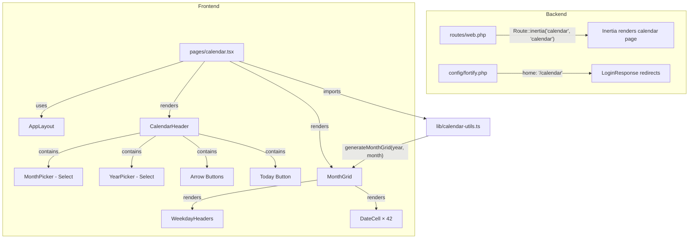

# Design Document: Calendar View

## Overview

The calendar view replaces the placeholder dashboard as the primary authenticated page. It renders a full-page monthly calendar grid with navigation controls, serving as the future surface for room-scheduling interactions.

The feature is entirely frontend-driven — no new database tables or API endpoints are required. The backend change is limited to renaming the route and updating the Fortify home path. All calendar logic (grid generation, navigation state, today detection) lives in React components using client-side date arithmetic.

### Key Design Decisions

1. **No server-side date logic** — The calendar is purely presentational at this stage. Month/year state lives in React component state, making navigation instant without network requests.
2. **Custom grid component, not react-day-picker** — The existing shadcn `Calendar` component wraps `react-day-picker` which is designed for date *picking* in popovers, not full-page display. A custom `MonthGrid` component gives full control over the 6-row fixed grid, filler date behavior, and future extensibility for booking overlays.
3. **Locale-aware via Intl API** — Weekday names and month names use the browser's `Intl.DateTimeFormat` for automatic localization without additional i18n libraries.
4. **State in URL-independent component state** — Navigation state (displayed month/year) is ephemeral React state. No URL query params needed at this stage since the calendar always resets to the current month on page load.

## Architecture



### Component Hierarchy

```
calendar.tsx (page)
├── CalendarHeader
│   ├── Button (previous month arrow)
│   ├── Select (month picker)
│   ├── Select (year picker)
│   ├── Button (next month arrow)
│   └── Button (go to current month / "Today")
└── MonthGrid
    ├── WeekdayHeaders (7 × <th>)
    └── DateCell × 42 (6 rows × 7 columns)
```

## Components and Interfaces

### `pages/calendar.tsx`

The top-level Inertia page component. Manages the displayed `year` and `month` as React state, initialized to the current month. Passes navigation callbacks down to `CalendarHeader` and grid data to `MonthGrid`.

```typescript
interface CalendarPageState {
  displayedYear: number;   // e.g., 2025
  displayedMonth: number;  // 0-indexed (0 = January, 11 = December)
}
```

**Layout integration:** Uses `AppLayout` with breadcrumbs showing "Calendar" linked to the calendar route via Wayfinder.

### `components/calendar-header.tsx`

Navigation toolbar rendered above the grid.

```typescript
interface CalendarHeaderProps {
  displayedYear: number;
  displayedMonth: number;
  onPreviousMonth: () => void;
  onNextMonth: () => void;
  onSelectMonth: (month: number) => void;
  onSelectYear: (year: number) => void;
  onGoToToday: () => void;
  isCurrentMonth: boolean;
}
```

**Sub-components used:**
- `Button` (variant: `outline`, size: `icon`) for arrows with `ChevronLeft` / `ChevronRight` icons
- `Select` (shadcn) for month picker (12 items) and year picker (11 items: current ± 5)
- `Button` (variant: `outline`) for "Today" with `disabled` prop when `isCurrentMonth` is true

### `components/month-grid.tsx`

The 6×7 calendar grid displaying date cells.

```typescript
interface MonthGridProps {
  grid: GridDate[];        // exactly 42 items
  today: DateInfo | null;  // null when current month isn't displayed
  onFillerDateClick: (year: number, month: number) => void;
}

interface GridDate {
  day: number;            // day of month (1-31)
  month: number;         // 0-indexed month this date belongs to
  year: number;          // year this date belongs to
  isCurrentMonth: boolean; // true if this date belongs to the displayed month
  isToday: boolean;       // true only if this is today AND isCurrentMonth
}

interface DateInfo {
  day: number;
  month: number;
  year: number;
}
```

**Rendering logic:**
- 7 column headers using locale weekday abbreviations
- 42 cells in a CSS Grid (6 rows × 7 columns)
- Filler dates get `text-muted-foreground` styling and are clickable
- Today's cell gets a `bg-primary text-primary-foreground font-semibold rounded-md` treatment (color + non-color differentiation via font weight and rounded shape)
- Today indicator only applied when `isCurrentMonth && isToday` — never on filler dates

### `lib/calendar-utils.ts`

Pure utility functions for calendar arithmetic. Fully testable without React.

```typescript
/**
 * Generates a 42-element array representing 6 complete weeks for the given month.
 * Includes leading filler dates from previous month and trailing filler dates from next month.
 */
export function generateMonthGrid(year: number, month: number): GridDate[];

/**
 * Returns the previous month/year, handling January → December rollover.
 */
export function getPreviousMonth(year: number, month: number): { year: number; month: number };

/**
 * Returns the next month/year, handling December → January rollover.
 */
export function getNextMonth(year: number, month: number): { year: number; month: number };

/**
 * Returns locale-aware abbreviated weekday names starting from the locale's first day of week.
 * Falls back to Sunday-start if locale detection fails.
 */
export function getWeekdayNames(locale?: string): string[];

/**
 * Determines the first day of the week for the given locale (0=Sunday, 1=Monday, etc.).
 */
export function getFirstDayOfWeek(locale?: string): number;
```

## Data Models

No new database models are required. The feature is purely frontend state:

| State | Type | Location | Lifecycle |
|-------|------|----------|-----------|
| `displayedYear` | `number` | React `useState` in `calendar.tsx` | Reset to current year on page load |
| `displayedMonth` | `number` (0-indexed) | React `useState` in `calendar.tsx` | Reset to current month on page load |
| Grid data | `GridDate[]` | Derived (computed from year/month) | Recomputed on state change |
| Today | `DateInfo` | Computed once on render | Stable for page session |

### Backend Changes

| File | Change |
|------|--------|
| `config/fortify.php` | `'home' => '/calendar'` |
| `routes/web.php` | Replace `Route::inertia('dashboard', 'dashboard')->name('dashboard')` with `Route::inertia('calendar', 'calendar')->name('calendar')` |
| `app/Http/Responses/Concerns/RedirectsToCurrentCongregation.php` | No changes needed — it appends the Fortify `redirects('login')` value which reads from config |
| `resources/js/pages/dashboard.tsx` | Delete |
| `resources/js/pages/calendar.tsx` | Create |

## Correctness Properties

*A property is a characteristic or behavior that should hold true across all valid executions of a system — essentially, a formal statement about what the system should do. Properties serve as the bridge between human-readable specifications and machine-verifiable correctness guarantees.*

### Property 1: Grid generation produces exactly 42 cells with correct dates

*For any* valid year (within ±10 of current) and month (0–11), `generateMonthGrid(year, month)` SHALL return exactly 42 `GridDate` entries where: (a) all days of the target month appear in sequential order, (b) leading filler dates are the correct final days of the previous month in descending-to-ascending order, and (c) trailing filler dates start at 1 and increment sequentially.

**Validates: Requirements 2.4, 3.1, 3.2**

### Property 2: Filler date click target correctness

*For any* grid produced by `generateMonthGrid(year, month)`, every `GridDate` where `isCurrentMonth === false` SHALL have a `month` and `year` value that corresponds to a valid adjacent month (either the previous or next month relative to the displayed month).

**Validates: Requirements 3.4**

### Property 3: Month navigation arithmetic

*For any* valid year and month, `getPreviousMonth(year, month)` SHALL return the month immediately before (with January of year Y producing December of year Y-1), and `getNextMonth(year, month)` SHALL return the month immediately after (with December of year Y producing January of year Y+1). Additionally, `getNextMonth(getPreviousMonth(year, month))` SHALL return the original `{year, month}`.

**Validates: Requirements 4.2, 4.3**

### Property 4: Picker selection state consistency

*For any* month selection M (0–11) applied to a state with year Y, the resulting displayed state SHALL be `{year: Y, month: M}`. For any year selection Y applied to a state with month M, the resulting displayed state SHALL be `{year: Y, month: M}`.

**Validates: Requirements 5.3, 5.4**

### Property 5: Today button disabled state

*For any* displayed year and month, the "Go to current month" button SHALL be disabled if and only if the displayed year equals the current year AND the displayed month equals the current month.

**Validates: Requirements 6.3**

### Property 6: Today indicator exclusivity

*For any* `GridDate` in a grid generated for a month that is NOT the current month (or current year), `isToday` SHALL be `false` for all 42 cells. Furthermore, for a grid of the current month, `isToday` SHALL be `true` for exactly one cell, and that cell SHALL have `isCurrentMonth === true`.

**Validates: Requirements 7.1, 7.3, 7.4**

## Error Handling

This feature has minimal error surface since it's purely client-side date arithmetic with no network calls or user input validation.

| Scenario | Handling |
|----------|----------|
| Invalid locale for `Intl.DateTimeFormat` | Fall back to `"en-US"` locale with Sunday as first day of week |
| Navigation beyond ±10 year bounds | Arrow buttons become disabled at boundaries; pickers only list valid years |
| Browser without `Intl` support | Graceful degradation — hardcoded English weekday/month names |
| Old `/dashboard` URL accessed | Laravel returns 404 (route no longer exists) |
| Page accessed without auth | Middleware redirects to login (existing behavior, unchanged) |

## Testing Strategy

### Unit Tests (Pest — backend)

- **Route existence:** `GET /{congregation}/calendar` returns 200 with Inertia component `calendar`
- **Old route removal:** `GET /{congregation}/dashboard` returns 404
- **Fortify home path:** Config value `fortify.home` equals `/calendar`
- **Auth redirect:** After login, user is redirected to `/{congregation}/calendar`

### Unit Tests (Vitest — frontend)

- **`calendar-utils.ts` functions:** Example-based tests for known months (e.g., February 2024 starts on Thursday, March 2025 starts on Saturday)
- **Edge cases:** Leap year February, months starting on Sunday, months starting on Saturday
- **Locale handling:** Verify weekday names respect locale parameter

### Property-Based Tests (Vitest + fast-check)

Each correctness property maps to a single property-based test with minimum 100 iterations:

| Property | Test Target | Generator |
|----------|-------------|-----------|
| Property 1: Grid generation | `generateMonthGrid` | Random year (±10) × random month (0–11) |
| Property 2: Filler date targets | `generateMonthGrid` result filtering | Same generator, filter non-current-month cells |
| Property 3: Navigation arithmetic | `getPreviousMonth`, `getNextMonth` | Random year × random month |
| Property 4: Picker selection | State reducer logic | Random month (0–11) × random year (±5) |
| Property 5: Today button state | Computed `isCurrentMonth` flag | Random year × random month |
| Property 6: Today indicator | `generateMonthGrid` with today check | Random year × random month |

**Library:** `fast-check` (widely used, TypeScript-native, integrates with Vitest)

**Tag format:** Each test includes a comment:
```typescript
// Feature: calendar-view, Property {N}: {title}
```

### Component Tests (Vitest + React Testing Library)

- Render `MonthGrid` with known grid data, verify 42 cells rendered
- Verify filler dates have `text-muted-foreground` class
- Verify today cell has `font-semibold` and `bg-primary` classes
- Verify "Today" button is disabled when displaying current month
- Verify arrow buttons have accessible labels
- Verify month/year pickers show correct options

### Integration Tests (Pest — feature tests)

- Full login flow redirects to `/calendar` route
- Calendar page renders within authenticated layout
- Unauthenticated access redirects to login
