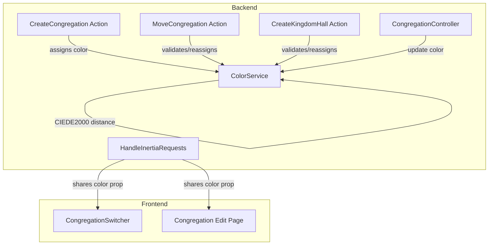

# Design Document: Congregation Color

## Overview

This feature adds a persistent color attribute to each congregation, used to visually distinguish congregations sharing a Kingdom Hall in scheduling views, the congregation switcher, and other shared UI. Colors are auto-generated on creation and validated using the CIEDE2000 perceptual distance algorithm to ensure sufficient visual distinction (minimum distance of 25) between all congregations in the same hall.

The implementation introduces a `ColorService` (single-purpose action-style class in `app/Services/`) responsible for color generation, distance calculation, and validation. The color column is added to the `congregations` table and exposed through existing Inertia shared props.

## Architecture



### Key Design Decisions

1. **ColorService as a dedicated service class** — Color logic (RGB→XYZ→Lab conversion, CIEDE2000 calculation, generation with distance constraints) is non-trivial math that doesn't fit into an Eloquent model or a simple action. A service class keeps it testable in isolation.

2. **Hook into existing actions rather than model events** — Using model `creating`/`updating` events would make it harder to pass context (sibling colors, kingdom hall). Instead, the existing `CreateCongregation`, `MoveCongregation`, and `CreateKingdomHall` actions call the `ColorService` explicitly.

3. **Store color on the `congregations` table** — A simple `color` column (`CHAR(7)`, default `null`) keeps things straightforward. The `#RRGGBB` format is universal and directly usable in CSS.

4. **Frontend uses inline `background-color` style** — Rather than generating Tailwind classes dynamically (which won't work with JIT), the color swatch uses an inline style with the hex value.

## Components and Interfaces

### ColorService (`app/Services/ColorService.php`)

```php
class ColorService
{
    private const MIN_DISTANCE = 25.0;
    private const MAX_ATTEMPTS = 100;

    /**
     * Generate a random color with sufficient distance from existing siblings.
     *
     * @param list<string> $siblingColors  Hex colors of sibling congregations
     * @return string  Generated hex color in #RRGGBB format
     * @throws \App\Exceptions\ColorGenerationException
     */
    public function generateDistinctColor(array $siblingColors): string;

    /**
     * Validate a color has sufficient distance from all siblings.
     *
     * @param string $color  Hex color to validate
     * @param list<string> $siblingColors  Hex colors of sibling congregations
     * @return bool
     */
    public function isDistinctFromAll(string $color, array $siblingColors): bool;

    /**
     * Calculate CIEDE2000 distance between two hex colors.
     *
     * @param string $hex1  First hex color (#RRGGBB)
     * @param string $hex2  Second hex color (#RRGGBB)
     * @return float  Non-negative distance rounded to 4 decimal places
     */
    public function ciede2000Distance(string $hex1, string $hex2): float;

    /**
     * Convert hex RGB to CIELAB color space using D65/2° observer.
     *
     * @param string $hex  Hex color (#RRGGBB)
     * @return array{L: float, a: float, b: float}
     */
    public function hexToLab(string $hex): array;

    /**
     * Validate hex color format.
     *
     * @param string $hex
     * @return bool
     */
    public static function isValidHex(string $hex): bool;
}
```

### ColorGenerationException (`app/Exceptions/ColorGenerationException.php`)

A custom exception thrown when `generateDistinctColor` exhausts its 100-attempt budget.

### UpdateCongregationColor Action (`app/Actions/Congregations/UpdateCongregationColor.php`)

```php
class UpdateCongregationColor
{
    public function __construct(private ColorService $colorService) {}

    /**
     * Validate and update a congregation's color.
     *
     * @throws ValidationException
     */
    public function handle(Congregation $congregation, string $color): Congregation;
}
```

### Modified Existing Components

| Component | Change |
|-----------|--------|
| `CreateCongregation` action | Call `ColorService::generateDistinctColor()` with sibling colors before `Congregation::create()` |
| `MoveCongregation` action | After updating `kingdom_hall_id`, validate color against new siblings; regenerate if needed |
| `CreateKingdomHall` action | After associating congregation with hall, validate/regenerate color against new siblings |
| `CongregationController::update()` | Add `color` to validated fields; delegate to `UpdateCongregationColor` |
| `HandleInertiaRequests` | No change needed — `currentCongregation` already serializes all model attributes including `color` |
| `CongregationFactory` | Add `color` to default definition using random hex |

### Frontend Components

| Component | Change |
|-----------|--------|
| `congregation-switcher.tsx` | Add a 12×12px color swatch before each congregation name |
| `congregations/edit.tsx` | Add color picker input (hex text field with preview swatch) for admins |
| `types/congregations.ts` | Add `color: string \| null` to `Congregation` type |

## Data Models

### Migration: Add `color` column to `congregations` table

```sql
ALTER TABLE congregations ADD COLUMN color CHAR(7) NULL;
```

Migration file: `database/migrations/xxxx_xx_xx_xxxxxx_add_color_to_congregations_table.php`

```php
Schema::table('congregations', function (Blueprint $table) {
    $table->char('color', 7)->nullable()->after('kingdom_hall_id');
});
```

A follow-up data migration (or seeder) generates colors for existing congregations using `ColorService::generateDistinctColor()`.

### Updated Congregation Model

Add `'color'` to the `$fillable` array.

### Color Validation Rules

| Rule | Constraint |
|------|-----------|
| Format | `/^#[0-9A-F]{6}$/i` — stored as uppercase |
| Distance | CIEDE2000 ≥ 25 from all siblings in same Kingdom Hall |
| Nullable | Allowed (congregation without a kingdom hall, or legacy data) |


## Correctness Properties

*A property is a characteristic or behavior that should hold true across all valid executions of a system — essentially, a formal statement about what the system should do. Properties serve as the bridge between human-readable specifications and machine-verifiable correctness guarantees.*

### Property 1: Generated colors maintain minimum distance from siblings

*For any* set of valid sibling hex colors (0–10 siblings) within a Kingdom Hall, when `ColorService::generateDistinctColor()` produces a color, the CIEDE2000 distance between that color and every sibling SHALL be at least 25.0.

**Validates: Requirements 1.1, 1.5, 2.1, 2.3, 2.4, 3.1**

### Property 2: All generated colors have valid hex format

*For any* invocation of `ColorService::generateDistinctColor()` (with or without sibling colors), the returned string SHALL match the pattern `/^#[0-9A-F]{6}$/`.

**Validates: Requirements 1.2, 1.3**

### Property 3: Colors below minimum distance are rejected

*For any* proposed hex color and set of sibling hex colors where at least one sibling has a CIEDE2000 distance below 25.0 from the proposed color, `ColorService::isDistinctFromAll()` SHALL return `false` and the update action SHALL reject the change with a validation error.

**Validates: Requirements 2.2, 3.5**

### Property 4: Hex format validation accepts valid colors and rejects invalid strings

*For any* string, `ColorService::isValidHex()` SHALL return `true` if and only if the string matches `/^#[0-9A-Fa-f]{6}$/`. Furthermore, valid input in any casing SHALL be stored as uppercase.

**Validates: Requirements 3.3, 3.4**

### Property 5: CIEDE2000 distance is non-negative

*For any* two valid hex colors A and B, `ColorService::ciede2000Distance(A, B)` SHALL produce a result ≥ 0.

**Validates: Requirements 4.2**

### Property 6: CIEDE2000 distance is symmetric

*For any* two valid hex colors A and B, `|ciede2000Distance(A, B) - ciede2000Distance(B, A)|` SHALL be ≤ 0.0001.

**Validates: Requirements 4.3**

### Property 7: CIEDE2000 distance identity

*For any* valid hex color A, `ciede2000Distance(A, A)` SHALL equal 0.0000.

**Validates: Requirements 4.4**

### Property 8: Invalid hex input throws validation error

*For any* string that does not match the pattern `/^#[0-9A-Fa-f]{6}$/`, passing it to `ciede2000Distance()` SHALL throw a validation error.

**Validates: Requirements 4.5**

## Error Handling

| Scenario | Error Type | User-Facing Message |
|----------|-----------|-------------------|
| Color generation exhausts 100 attempts | `ColorGenerationException` (caught by action, converted to `ValidationException`) | "Unable to generate a sufficiently distinct color. The Kingdom Hall may have too many congregations with similar colors." |
| Move fails due to color conflict (100 attempts exhausted) | `ValidationException` on `kingdom_hall` field | "Cannot move congregation: unable to generate a sufficiently distinct color for the destination Kingdom Hall." |
| Admin submits invalid hex format | Laravel validation error on `color` field | "The color must be a valid hex color (e.g., #3B82F6)." |
| Admin submits color too similar to sibling | Laravel validation error on `color` field | "This color is too similar to another congregation's color in this Kingdom Hall." |
| Member attempts color change | 403 Forbidden (policy) | Standard 403 page (no custom message needed) |
| Invalid hex passed to `ciede2000Distance()` | `\InvalidArgumentException` | N/A (developer-facing, not user-facing) |

### Error Flow

1. **Validation errors** surface as inline form errors via Inertia's standard error bag — the `color` field key maps to the color input on the edit page.
2. **ColorGenerationException** is caught within the action's transaction and converted to a `ValidationException` so it rolls back cleanly and returns a user-friendly message.
3. **Authorization failures** are handled by the existing `CongregationPolicy::update()` check — no new policy method needed since color updates are part of congregation settings.

## Testing Strategy

### Property-Based Tests (Pest + `pestphp/pest-plugin-faker` for generation)

Since Pest doesn't have a built-in PBT plugin with shrinking, property tests will use a loop-based approach running **100 iterations** per property with randomly generated inputs via `fake()`. Each test will be tagged with its design property reference.

| Property | Test File | Iterations |
|----------|-----------|-----------|
| P1: Distance ≥ 25 from siblings | `tests/Feature/Properties/ColorDistanceGenerationTest.php` | 100 |
| P2: Valid hex format | `tests/Feature/Properties/ColorDistanceGenerationTest.php` | 100 |
| P3: Below-threshold rejected | `tests/Feature/Properties/ColorDistanceGenerationTest.php` | 100 |
| P4: Format validation | `tests/Feature/Properties/ColorValidationPropertyTest.php` | 100 |
| P5: Non-negative distance | `tests/Feature/Properties/ColorDistancePropertyTest.php` | 100 |
| P6: Symmetric distance | `tests/Feature/Properties/ColorDistancePropertyTest.php` | 100 |
| P7: Identity distance | `tests/Feature/Properties/ColorDistancePropertyTest.php` | 100 |
| P8: Invalid hex throws | `tests/Feature/Properties/ColorDistancePropertyTest.php` | 100 |

### Unit Tests

| Test | File |
|------|------|
| `hexToLab` produces correct values for known reference colors | `tests/Unit/ColorServiceTest.php` |
| `ciede2000Distance` matches published reference pairs | `tests/Unit/ColorServiceTest.php` |
| Color generation with no siblings produces valid color | `tests/Unit/ColorServiceTest.php` |
| Color generation throws after 100 failed attempts | `tests/Unit/ColorServiceTest.php` |

### Feature Tests

| Test | File |
|------|------|
| Admin can update congregation color | `tests/Feature/Congregations/CongregationColorTest.php` |
| Member cannot update congregation color (403) | `tests/Feature/Congregations/CongregationColorTest.php` |
| Invalid hex format returns validation error | `tests/Feature/Congregations/CongregationColorTest.php` |
| Too-similar color returns validation error | `tests/Feature/Congregations/CongregationColorTest.php` |
| Successful update shows toast message | `tests/Feature/Congregations/CongregationColorTest.php` |
| Color assigned on congregation creation | `tests/Feature/Congregations/CongregationColorTest.php` |
| Color validated/regenerated on move | `tests/Feature/Congregations/CongregationColorTest.php` |
| Color validated/regenerated on kingdom hall setup | `tests/Feature/Congregations/CongregationColorTest.php` |
| Shared props include color on congregation objects | `tests/Feature/Congregations/CongregationColorTest.php` |
| Self-exclusion: congregation's own color not compared against itself | `tests/Feature/Congregations/CongregationColorTest.php` |

### Test Tag Format

Each property test will include a comment:
```php
// Feature: congregation-color, Property {N}: {property_text}
```
