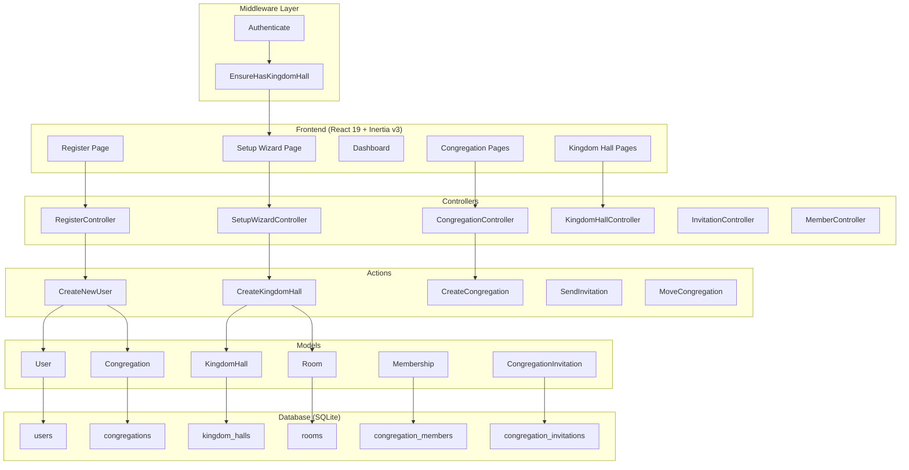
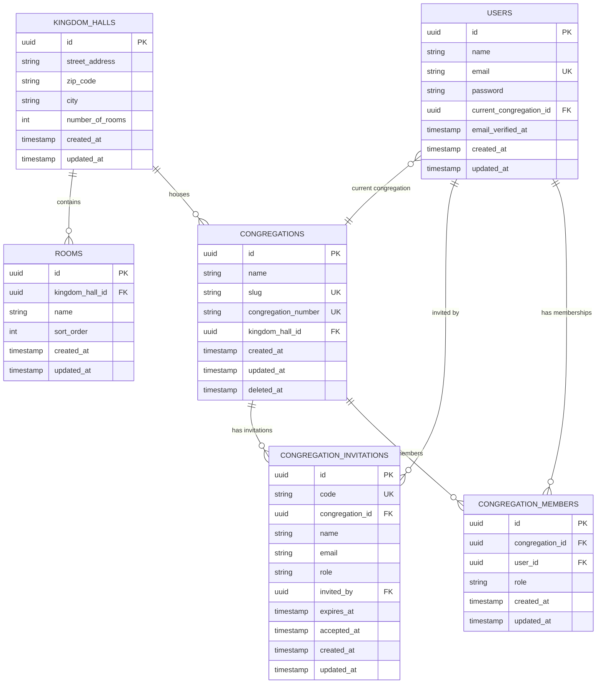

# Design Document: Congregation Management

## Overview

This design rearchitects the existing Team-based system into a Congregation-based domain model tailored for Jehovah's Witnesses Kingdom Hall room-booking. The key transformations are:

1. **Rename Team → Congregation** with a new `congregation_number` field and removal of personal teams
2. **Introduce Kingdom Hall** as the physical building entity that groups congregations
3. **Introduce Room** as a bookable space auto-generated from Kingdom Hall configuration
4. **Replace the role system** from Owner/Admin/Member to Superadmin/Admin/Member with scope changes
5. **Add a Setup Wizard** that forces Kingdom Hall creation after registration
6. **Migrate to UUID v7 primary keys** across all models

The migration strategy uses new migrations (not modifying existing ones) to rename tables, add columns, and create new tables. The existing `teams` → `congregations`, `team_members` → `congregation_members`, and `team_invitations` → `congregation_invitations` renaming happens at the database level.

## Architecture



### Middleware Pipeline

All authenticated routes pass through:
1. `Authenticate` — standard Laravel auth
2. `EnsureHasKingdomHall` — redirects to Setup Wizard if user's congregation has no Kingdom Hall

The Setup Wizard and logout routes are exempt from `EnsureHasKingdomHall`.

### Route Structure

Routes transition from `/{current_team}/...` to `/{current_congregation}/...`:

```
POST   /register                          → Auth registration
GET    /setup                             → Setup Wizard (exempt from KH check)
POST   /setup                             → Setup Wizard submission
GET    /{congregation}/dashboard          → Dashboard
GET    /{congregation}/members            → Member list
POST   /{congregation}/members/invite     → Send invitation
PUT    /{congregation}/members/{member}   → Update member role
DELETE /{congregation}/members/{member}   → Remove member
GET    /{congregation}/kingdom-hall       → Kingdom Hall details
PUT    /{congregation}/kingdom-hall       → Update Kingdom Hall
DELETE /{congregation}/kingdom-hall       → Delete Kingdom Hall
POST   /{congregation}/kingdom-hall/congregations → Add congregation
POST   /{congregation}/move              → Move congregation
DELETE /{congregation}                    → Delete congregation
```

## Components and Interfaces

### Backend Components

#### Models

| Model | Table | Key Relationships |
|-------|-------|-------------------|
| `User` | `users` | belongsToMany Congregation (via Membership), belongsTo currentCongregation |
| `Congregation` | `congregations` | belongsTo KingdomHall, belongsToMany User (via Membership), hasMany CongregationInvitation |
| `KingdomHall` | `kingdom_halls` | hasMany Congregation, hasMany Room |
| `Room` | `rooms` | belongsTo KingdomHall |
| `Membership` | `congregation_members` | belongsTo User, belongsTo Congregation |
| `CongregationInvitation` | `congregation_invitations` | belongsTo Congregation, belongsTo User (inviter) |

#### Enums

**`CongregationRole`** (replaces `TeamRole`):
```php
enum CongregationRole: string
{
    case Superadmin = 'superadmin';
    case Admin = 'admin';
    case Member = 'member';
}
```

#### Actions

| Action | Purpose |
|--------|---------|
| `CreateNewUser` | Modified: creates User + Congregation (no personal team), assigns admin role |
| `CreateKingdomHall` | Creates KH, auto-generates Rooms, links Congregation, assigns superadmin |
| `CreateCongregation` | Creates a new Congregation under a Kingdom Hall with initial invitation |
| `SendInvitation` | Sends invitation email, handles existing users vs new users |
| `MoveCongregation` | Moves a congregation between Kingdom Halls, handles role revocation |
| `DeleteCongregation` | Soft-deletes congregation, removes exclusive members, handles cascading |
| `DeleteKingdomHall` | Deletes KH and all connected congregations |

#### Middleware

**`EnsureHasKingdomHall`**: Checks if the authenticated user's current congregation has a linked Kingdom Hall. If not, redirects to `/setup`. Exempt routes: `setup.*`, `logout`.

#### Policies

**`CongregationPolicy`**: Authorizes congregation-scoped actions based on role + scope rules:
- Superadmin: full access to all congregations in their Kingdom Hall
- Admin: full access to own congregation only
- Member: view-only access to own congregation

**`KingdomHallPolicy`**: Restricts KH management to superadmin role.

**`MemberPolicy`**: Controls member invite/edit/remove based on role hierarchy.

### Frontend Components

#### Pages

| Page | Route | Description |
|------|-------|-------------|
| `auth/register.tsx` | `/register` | Modified: adds congregation name + number fields |
| `setup/index.tsx` | `/setup` | New: Kingdom Hall creation wizard |
| `congregations/show.tsx` | `/{congregation}/` | Congregation overview |
| `congregations/members/index.tsx` | `/{congregation}/members` | Member management |
| `congregations/kingdom-hall/show.tsx` | `/{congregation}/kingdom-hall` | KH details + room management |

#### Shared Components

- `CongregationSwitcher` — replaces TeamSwitcher in sidebar
- `InviteMemberDialog` — modal for sending invitations
- `RoleSelect` — dropdown for role assignment (filtered by viewer's role)

### TypeScript Types

```typescript
interface Congregation {
    id: string;
    name: string;
    slug: string;
    congregation_number: string;
    kingdom_hall_id: string | null;
    kingdom_hall?: KingdomHall;
}

interface KingdomHall {
    id: string;
    street_address: string;
    zip_code: string;
    city: string;
    number_of_rooms: number;
    rooms?: Room[];
    congregations?: Congregation[];
}

interface Room {
    id: string;
    kingdom_hall_id: string;
    name: string;
}

interface Membership {
    id: string;
    user_id: string;
    congregation_id: string;
    role: 'superadmin' | 'admin' | 'member';
    user?: User;
}

interface CongregationInvitation {
    id: string;
    congregation_id: string;
    name: string;
    email: string;
    role: 'superadmin' | 'admin' | 'member';
    code: string;
    expires_at: string;
    accepted_at: string | null;
}
```

## Data Models

### Entity Relationship Diagram



### Migration Strategy

Since the current schema uses auto-incrementing IDs and we need UUIDs, a fresh migration approach is best:

1. **New migration: Rename + restructure teams table**
   - Rename `teams` → `congregations`
   - Drop `is_personal` column
   - Add `congregation_number` (string, unique)
   - Change `id` from auto-increment to `uuid`

2. **New migration: Create `kingdom_halls` table**
   - UUID primary key
   - `street_address`, `zip_code`, `city`, `number_of_rooms`

3. **New migration: Create `rooms` table**
   - UUID primary key
   - `kingdom_hall_id` (foreignUuid)
   - `name`, `sort_order`

4. **New migration: Restructure `team_members` → `congregation_members`**
   - Rename table
   - Convert to UUID PKs and FKs
   - Update role values (owner → superadmin)

5. **New migration: Restructure `team_invitations` → `congregation_invitations`**
   - Rename table
   - Add `name` column
   - Convert to UUID PKs and FKs

6. **New migration: Update `users` table**
   - Rename `current_team_id` → `current_congregation_id`
   - Convert to UUID PKs and FKs

### Database Column Details

#### `congregations`
| Column | Type | Constraints |
|--------|------|-------------|
| id | uuid | PK |
| name | string(255) | NOT NULL |
| slug | string(255) | UNIQUE, NOT NULL |
| congregation_number | string(20) | UNIQUE, NOT NULL |
| kingdom_hall_id | uuid | FK → kingdom_halls.id, NULLABLE |
| created_at | timestamp | |
| updated_at | timestamp | |
| deleted_at | timestamp | NULLABLE (soft delete) |

#### `kingdom_halls`
| Column | Type | Constraints |
|--------|------|-------------|
| id | uuid | PK |
| street_address | string(255) | NOT NULL |
| zip_code | string(20) | NOT NULL |
| city | string(100) | NOT NULL |
| number_of_rooms | integer | NOT NULL, MIN 1, MAX 50 |
| created_at | timestamp | |
| updated_at | timestamp | |

#### `rooms`
| Column | Type | Constraints |
|--------|------|-------------|
| id | uuid | PK |
| kingdom_hall_id | uuid | FK → kingdom_halls.id, CASCADE DELETE |
| name | string(255) | NOT NULL |
| sort_order | integer | NOT NULL |
| created_at | timestamp | |
| updated_at | timestamp | |

#### `congregation_members`
| Column | Type | Constraints |
|--------|------|-------------|
| id | uuid | PK |
| congregation_id | uuid | FK → congregations.id, CASCADE DELETE |
| user_id | uuid | FK → users.id, CASCADE DELETE |
| role | string | NOT NULL (superadmin, admin, member) |
| created_at | timestamp | |
| updated_at | timestamp | |
| | | UNIQUE(congregation_id, user_id) |

#### `congregation_invitations`
| Column | Type | Constraints |
|--------|------|-------------|
| id | uuid | PK |
| code | string(64) | UNIQUE, NOT NULL |
| congregation_id | uuid | FK → congregations.id, CASCADE DELETE |
| name | string(255) | NOT NULL |
| email | string(255) | NOT NULL |
| role | string | NOT NULL |
| invited_by | uuid | FK → users.id, CASCADE DELETE |
| expires_at | timestamp | NULLABLE |
| accepted_at | timestamp | NULLABLE |
| created_at | timestamp | |
| updated_at | timestamp | |

## Correctness Properties

*A property is a characteristic or behavior that should hold true across all valid executions of a system — essentially, a formal statement about what the system should do. Properties serve as the bridge between human-readable specifications and machine-verifiable correctness guarantees.*

### Property 1: Congregation number validation

*For any* string input used as a congregation number, the system SHALL accept it if and only if it is 1–20 characters long and consists exclusively of digits (0–9) and uppercase Latin letters (A–Z). All other strings SHALL be rejected.

**Validates: Requirements 1.3, 2.7**

### Property 2: Registration validation rejects incomplete or invalid submissions

*For any* registration form submission where one or more required fields (congregation name, congregation number, user name, email, password, password confirmation) are missing or fail their respective validation rules, the system SHALL reject the submission and return field-specific errors while preserving non-password field values.

**Validates: Requirements 2.1, 2.6**

### Property 3: Registration uniqueness constraints

*For any* registration attempt where the congregation number or email already exists in the system, the system SHALL reject the registration. Neither a duplicate congregation number nor a duplicate email SHALL produce a new record.

**Validates: Requirements 2.4, 2.5**

### Property 4: Registration assigns admin role

*For any* valid registration submission, the registering user SHALL be assigned the admin role in the newly created congregation.

**Validates: Requirements 2.3**

### Property 5: Room auto-generation produces correctly named rooms

*For any* Kingdom Hall creation or room count increase where the target is N rooms (1 ≤ N ≤ 50), the system SHALL ensure exactly N Room records exist, named "Room 1" through "Room N" in sequential order.

**Validates: Requirements 3.3, 3.6**

### Property 6: Kingdom Hall modification guards

*For any* attempt to delete a Kingdom Hall with associated congregations, or to decrease the room count below the current number of rooms, the system SHALL reject the operation.

**Validates: Requirements 3.5, 3.7**

### Property 7: Setup wizard gate blocks all protected routes

*For any* authenticated user whose congregation has no linked Kingdom Hall, and *for any* route other than the Setup Wizard and logout, the system SHALL redirect the user to the Setup Wizard.

**Validates: Requirements 4.2, 4.4**

### Property 8: Setup wizard creates complete Kingdom Hall configuration

*For any* valid setup wizard submission (valid address, zip, city, and room count 1–50), the system SHALL atomically create the Kingdom Hall, generate the correct number of Room records, link the congregation to the Kingdom Hall, and assign the superadmin role to the submitting user.

**Validates: Requirements 4.3**

### Property 9: Role scope enforcement

*For any* user with a given role, the system SHALL enforce that: (a) a superadmin can perform management actions on all congregations in their Kingdom Hall, (b) an admin can perform management actions only on their own congregation, and (c) a member cannot perform any management actions (invite, edit, remove, delete, move).

**Validates: Requirements 5.2, 5.3, 5.4, 7.1, 7.7**

### Property 10: Last privileged role invariant

*For any* operation that would remove or demote the last admin of a congregation, or the last superadmin of a Kingdom Hall, the system SHALL reject the operation and preserve the existing role assignment.

**Validates: Requirements 5.6, 6.10, 7.6**

### Property 11: Room decrease removes highest-numbered rooms without bookings

*For any* room count decrease on a Kingdom Hall, the system SHALL remove only the highest-numbered rooms that exceed the new total, and SHALL reject the decrease if any of those rooms have future bookings.

**Validates: Requirements 6.3, 6.4**

### Property 12: Invitation authorization scoping

*For any* invitation attempt, the system SHALL permit it if and only if: (a) the inviter is a superadmin for the Kingdom Hall containing the target congregation (any role allowed), or (b) the inviter is an admin of the target congregation (only member or admin roles allowed). All other attempts SHALL be rejected.

**Validates: Requirements 6.7, 7.1, 8.5, 8.6**

### Property 13: Invitation expiry enforcement

*For any* invitation, the system SHALL set the expiry to exactly 72 hours from creation. *For any* attempt to accept an invitation after its expiry timestamp, the system SHALL reject the acceptance.

**Validates: Requirements 8.1, 8.7**

### Property 14: Existing user invitation adds membership directly

*For any* invitation sent to an email that already belongs to an existing user, the system SHALL add that user to the target congregation with the invited role without requiring a new password setup.

**Validates: Requirements 8.3**

### Property 15: Duplicate invitation replacement

*For any* invitation sent to an email that already has a pending invitation for the same congregation, the system SHALL replace the previous pending invitation with the new one, resulting in exactly one pending invitation for that email-congregation pair.

**Validates: Requirements 8.8**

### Property 16: Congregation move preserves membership and roles

*For any* congregation moved between Kingdom Halls, all existing memberships and congregation-scoped roles (admin, member) SHALL be preserved unchanged after the move.

**Validates: Requirements 10.3**

### Property 17: Invalid move target rejection

*For any* congregation move where the target Kingdom Hall does not exist or is the same as the congregation's current Kingdom Hall, the system SHALL reject the operation.

**Validates: Requirements 10.4**

### Property 18: Superadmin revocation on congregation move

*For any* user whose only congregation in a Kingdom Hall is moved to a different Kingdom Hall, the system SHALL revoke their superadmin role in the original Kingdom Hall.

**Validates: Requirements 10.5**

### Property 19: Exclusive user removal on entity deletion

*For any* congregation deletion or Kingdom Hall deletion, users who belong exclusively to the deleted congregation(s) SHALL be removed from the system. Users who belong to other congregations SHALL be retained.

**Validates: Requirements 11.1, 11.2, 11.3**

### Property 20: Multi-congregation user retention on deletion

*For any* user who belongs to multiple congregations, when one of their congregations is deleted, the system SHALL retain the user and switch their current congregation to another active congregation they belong to.

**Validates: Requirements 11.4**

## Error Handling

### Validation Errors

| Context | Behavior |
|---------|----------|
| Registration form | Return 422 with field-specific error messages. Preserve all non-password field values in the response for re-population. |
| Setup Wizard form | Return 422 with field-specific error messages. Preserve entered values. |
| Kingdom Hall update | Return 422 with specific error (e.g., "Rooms must be removed individually before reducing the count"). |
| Congregation number format | Return validation error: "Congregation number must contain only digits and uppercase letters (A–Z)." |
| Congregation number uniqueness | Return validation error: "This congregation number is already in use." |

### Authorization Errors

| Context | Behavior |
|---------|----------|
| Role scope violation | Return 403 with message: "You do not have permission to perform this action." |
| Member attempts management | Return 403, redirect to congregation view. |
| Admin cross-congregation access | Return 403 with authorization error. |

### Business Rule Violations

| Context | Behavior |
|---------|----------|
| Last admin removal | Return 422: "Another admin must be assigned before this action can be completed." |
| Last superadmin demotion | Return 422: "Another superadmin must be assigned before you can remove your own superadmin role." |
| Delete KH with congregations | Return 422: "This Kingdom Hall cannot be removed while congregations are still assigned to it." |
| Room decrease with bookings | Return 422: "The following rooms still have future bookings and cannot be removed: Room X, Room Y." |
| Move to same/nonexistent KH | Return 422: "The target Kingdom Hall is invalid or the same as the current one." |
| Expired invitation acceptance | Return 410 (Gone): "This invitation has expired. Please request a new invitation." |

### Transaction Failures

| Context | Behavior |
|---------|----------|
| Registration transaction failure | Roll back both User and Congregation creation. Return 500 with generic error. Log detailed error. |
| Setup Wizard transaction failure | Roll back Kingdom Hall, Room, and role assignment. Return 500 with message: "Kingdom Hall creation failed. Please try again." |
| Congregation deletion failure | Roll back soft-delete and membership removal. Return 500 with generic error. |

### Edge Cases

- **Concurrent last-admin operations**: Use database-level locking (pessimistic lock on `congregation_members` row) when checking the last-admin invariant to prevent race conditions.
- **Invitation for deleted congregation**: Return 404 if the invitation's congregation has been soft-deleted when the user attempts to accept.
- **User with no remaining congregations after move/deletion**: Remove user from system (same as exclusive user removal).

## Testing Strategy

### Unit Tests (Pest v4)

Unit tests cover specific examples, edge cases, and integration points:

- **Model validation**: Test Congregation, KingdomHall, Room model validation rules with concrete examples
- **Registration flow**: Test complete registration creates User + Congregation + admin membership
- **Setup Wizard flow**: Test KH creation with room generation and role assignment
- **Role assignment**: Test specific role transitions and permission checks
- **Invitation acceptance**: Test expired link, existing user, new user flows
- **Deletion cascades**: Test soft-delete, exclusive user removal, multi-congregation retention
- **Move operations**: Test congregation movement with role revocation scenarios

### Property-Based Tests (Pest v4 with custom generators)

Property tests verify universal properties across randomized inputs. Each property test runs a **minimum of 100 iterations**.

Each test is tagged with a comment referencing the design property:

```php
// Feature: congregation-management, Property 1: Congregation number validation
test('congregation number accepts only valid alphanumeric strings 1-20 chars', function () {
    // Generate random strings, verify only uppercase alphanumeric 1-20 chars pass
})->repeat(100);
```

**Properties to implement as property tests:**

| Property | Test Focus |
|----------|------------|
| Property 1 | Generate random strings, verify congregation_number validation accepts/rejects correctly |
| Property 2 | Generate random incomplete form data, verify registration rejects with correct errors |
| Property 3 | Generate random duplicate congregation numbers/emails, verify uniqueness enforcement |
| Property 5 | Generate random room counts (1–50), verify correct room names generated |
| Property 7 | Generate random route paths, verify middleware redirects without KH |
| Property 9 | Generate random role+action combinations, verify scope enforcement |
| Property 10 | Generate random last-admin/superadmin removal scenarios, verify prevention |
| Property 13 | Generate invitations with random timestamps, verify expiry enforcement |
| Property 15 | Generate duplicate invitations, verify replacement (exactly one pending) |
| Property 16 | Generate random congregation memberships, move congregation, verify preservation |
| Property 19 | Generate random user membership graphs, delete congregation, verify exclusive removal |

### Integration Tests

Integration tests verify component interactions and external behavior:

- **Middleware pipeline**: Full HTTP request through auth → EnsureHasKingdomHall → controller
- **Email delivery**: Invitation email is queued with correct content and link
- **Transaction integrity**: Verify rollback on simulated failures
- **Route authorization**: Full request lifecycle for each role accessing each route group

### Test Organization

```
tests/
├── Feature/
│   ├── Congregations/
│   │   ├── RegistrationTest.php
│   │   ├── CongregationManagementTest.php
│   │   ├── CongregationDeletionTest.php
│   │   └── CongregationMovementTest.php
│   ├── KingdomHalls/
│   │   ├── SetupWizardTest.php
│   │   ├── KingdomHallManagementTest.php
│   │   └── RoomManagementTest.php
│   ├── Members/
│   │   ├── InvitationTest.php
│   │   ├── RoleManagementTest.php
│   │   └── MemberRemovalTest.php
│   └── Properties/
│       ├── CongregationNumberValidationTest.php
│       ├── RegistrationValidationTest.php
│       ├── RoomGenerationTest.php
│       ├── RoleScopeEnforcementTest.php
│       ├── LastPrivilegedRoleTest.php
│       ├── InvitationExpiryTest.php
│       ├── DeletionCascadeTest.php
│       └── MovePreservationTest.php
└── Unit/
    ├── CongregationRoleEnumTest.php
    ├── CongregationPolicyTest.php
    └── KingdomHallPolicyTest.php
```

### Testing Tools and Configuration

- **Framework**: Pest v4 with `RefreshDatabase` trait
- **Factories**: Create factories for User, Congregation, KingdomHall, Room, Membership, CongregationInvitation
- **Property tests**: Use Pest's `repeat(100)` with Faker-generated data for property iteration
- **Mocking**: Mock mail/notification for invitation tests
- **Database**: SQLite in-memory for fast test execution

