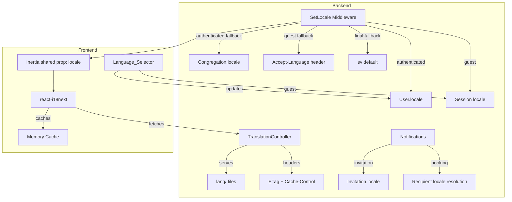

# Design Document: Full Localization

## Overview

This design implements full i18n for both backend (Laravel) and frontend (React/Inertia) with Swedish (sv) as the default language and English (en) as a supported secondary language. The architecture uses Laravel's `lang/` directory as the single source of truth, a cacheable JSON API endpoint for frontend consumption via react-i18next, and a middleware-based locale resolution system that respects user preferences, congregation defaults, and browser detection.

Key design decisions:
- **Single source of truth**: Laravel `lang/` files — no build-time bundling of translations
- **Runtime loading**: Frontend fetches translations from a Laravel endpoint, cached with ETag/Cache-Control
- **Middleware-based resolution**: A single `SetLocale` middleware handles all resolution logic for both auth and guest contexts
- **No full reload on language switch**: Frontend uses i18next's `changeLanguage()` + Inertia prop for seamless switching
- **Notification locale**: Each notification resolves its own locale using the recipient's preference or context-specific overrides

## Architecture



## Components and Interfaces

### Backend Components

#### 1. `SetLocale` Middleware (`app/Http/Middleware/SetLocale.php`)

Registered globally (before `HandleInertiaRequests`). Resolves and applies the active locale for every request.

```php
class SetLocale
{
    public function handle(Request $request, Closure $next): Response
    {
        $locale = $this->resolveLocale($request);
        app()->setLocale($locale);
        
        return $next($request);
    }
    
    private function resolveLocale(Request $request): string
    {
        if ($user = $request->user()) {
            return $this->resolveAuthenticatedLocale($user, $request);
        }
        
        return $this->resolveGuestLocale($request);
    }
    
    private function resolveAuthenticatedLocale(User $user, Request $request): string
    {
        // Priority: User_Locale > Congregation_Locale > sv
        if ($user->locale && $this->isSupported($user->locale)) {
            return $user->locale;
        }
        
        $congregation = $this->resolveCongregation($request, $user);
        if ($congregation?->locale && $this->isSupported($congregation->locale)) {
            return $congregation->locale;
        }
        
        return config('app.locale');
    }
    
    private function resolveGuestLocale(Request $request): string
    {
        // Priority: session > Accept-Language > sv
        if ($sessionLocale = $request->session()->get('locale')) {
            if ($this->isSupported($sessionLocale)) {
                return $sessionLocale;
            }
        }
        
        return $this->parseAcceptLanguage($request) ?? config('app.locale');
    }
    
    private function parseAcceptLanguage(Request $request): ?string
    {
        // Parse Accept-Language header, match by prefix (en-US -> en)
        // Return highest q-value match against supported locales
    }
    
    private function isSupported(string $locale): bool
    {
        return in_array($locale, config('app.supported_locales'), true);
    }
}
```

#### 2. `TranslationController` (`app/Http/Controllers/TranslationController.php`)

API endpoint at `/api/translations/{locale}`. Serves flattened JSON of all translation keys for the requested locale.

```php
class TranslationController extends Controller
{
    public function show(string $locale): JsonResponse
    {
        if (! in_array($locale, config('app.supported_locales'), true)) {
            abort(404);
        }
        
        $translations = $this->loadTranslations($locale);
        $body = json_encode($translations, JSON_THROW_ON_ERROR);
        $etag = '"' . md5($body) . '"';
        
        if (request()->header('If-None-Match') === $etag) {
            return response()->json(null, 304)
                ->header('ETag', $etag)
                ->header('Cache-Control', 'public, max-age=86400, must-revalidate');
        }
        
        return response($body, 200)
            ->header('Content-Type', 'application/json')
            ->header('ETag', $etag)
            ->header('Cache-Control', 'public, max-age=86400, must-revalidate');
    }
    
    private function loadTranslations(string $locale): array
    {
        // Load all PHP files from lang/{locale}/ and flatten with dot notation
        // Load lang/{locale}.json for single-file JSON translations
        // Merge into single flat key-value map
    }
}
```

#### 3. `LocaleController` (`app/Http/Controllers/Settings/LocaleController.php`)

Handles locale updates for authenticated users and guests.

```php
class LocaleController extends Controller
{
    // PATCH /settings/locale — authenticated user preference
    public function update(Request $request): RedirectResponse
    {
        $validated = $request->validate([
            'locale' => ['required', 'string', Rule::in(config('app.supported_locales'))],
        ]);
        
        $request->user()->update(['locale' => $validated['locale']]);
        
        return back();
    }
    
    // POST /locale — guest session preference (no auth required)
    public function store(Request $request): RedirectResponse
    {
        $validated = $request->validate([
            'locale' => ['required', 'string', Rule::in(config('app.supported_locales'))],
        ]);
        
        $request->session()->put('locale', $validated['locale']);
        
        return back();
    }
}
```

#### 4. `HandleInertiaRequests` Middleware Update

Share the resolved locale as an Inertia prop so the frontend knows the active locale:

```php
// In share() method, add:
'locale' => fn () => app()->getLocale(),
'supportedLocales' => config('app.supported_locales'),
```

#### 5. Notification Locale Resolution

Each notification uses Laravel's `locale()` method to render in the correct language:

```php
// For InvitationNotification — always use invitation locale
Notification::route('mail', $data['email'])
    ->notify(
        (new InvitationNotification($invitation))->locale($invitation->locale)
    );

// For BookingModifiedNotification / BookingDeletedNotification — use recipient resolution
$recipient->notify(
    (new BookingModifiedNotification(...))->locale(
        $recipient->locale 
            ?? $congregation->locale 
            ?? config('app.locale')
    )
);
```

### Frontend Components

#### 6. i18next Configuration (`resources/js/lib/i18n.ts`)

Custom backend plugin that fetches from the Translation_Endpoint with in-memory caching:

```typescript
import i18n from 'i18next';
import { initReactI18next } from 'react-i18next';

const translationCache: Record<string, Record<string, string>> = {};

const LaravelBackend = {
    type: 'backend' as const,
    init() {},
    read(language: string, _namespace: string, callback: (err: unknown, data?: Record<string, string>) => void) {
        if (translationCache[language]) {
            callback(null, translationCache[language]);
            return;
        }
        
        fetch(`/api/translations/${language}`)
            .then(res => {
                if (!res.ok) throw new Error(`HTTP ${res.status}`);
                return res.json();
            })
            .then(data => {
                translationCache[language] = data;
                callback(null, data);
            })
            .catch(err => callback(err));
    },
};

i18n.use(LaravelBackend).use(initReactI18next).init({
    fallbackLng: 'sv',
    supportedLngs: ['sv', 'en'],
    ns: ['translation'],
    defaultNS: 'translation',
    interpolation: { escapeValue: false },
    react: { useSuspense: true },
});

export default i18n;
```

#### 7. i18n Provider (`resources/js/lib/i18n-provider.tsx`)

Wraps the app, eagerly loads sv translations, and syncs with the Inertia locale prop:

```typescript
import { usePage } from '@inertiajs/react';
import { Suspense, useEffect } from 'react';
import { I18nextProvider, useTranslation } from 'react-i18next';
import i18n from '@/lib/i18n';

function I18nSync({ children }: { children: React.ReactNode }) {
    const { locale } = usePage().props as { locale: string };
    const { i18n: instance } = useTranslation();
    
    useEffect(() => {
        if (instance.language !== locale) {
            instance.changeLanguage(locale);
        }
    }, [locale, instance]);
    
    return <>{children}</>;
}

export function I18nProvider({ children }: { children: React.ReactNode }) {
    return (
        <I18nextProvider i18n={i18n}>
            <Suspense fallback={null}>
                <I18nSync>{children}</I18nSync>
            </Suspense>
        </I18nextProvider>
    );
}
```

#### 8. Language_Selector Component (`resources/js/components/language-selector.tsx`)

Two variants — one for the sidebar (authenticated) and one for the welcome page (guest):

```typescript
import { useForm, usePage } from '@inertiajs/react';
import { Globe } from 'lucide-react';
import { useTranslation } from 'react-i18next';

import { Button } from '@/components/ui/button';
import {
    DropdownMenu,
    DropdownMenuContent,
    DropdownMenuItem,
    DropdownMenuTrigger,
} from '@/components/ui/dropdown-menu';

const LOCALE_LABELS: Record<string, string> = {
    sv: 'Svenska',
    en: 'English',
};

export function LanguageSelector() {
    const { locale, supportedLocales, auth } = usePage().props as {
        locale: string;
        supportedLocales: string[];
        auth: { user: unknown };
    };
    const { t } = useTranslation();
    
    const form = useForm({ locale: '' });
    
    function handleSelect(newLocale: string) {
        if (newLocale === locale) return;
        
        form.transform(() => ({ locale: newLocale }));
        
        if (auth.user) {
            form.patch('/settings/locale', { preserveScroll: true });
        } else {
            form.post('/locale', { preserveScroll: true });
        }
    }
    
    return (
        <DropdownMenu>
            <DropdownMenuTrigger asChild>
                <Button variant="ghost" size="sm" className="gap-2">
                    <Globe className="size-4" />
                    <span>{LOCALE_LABELS[locale]}</span>
                </Button>
            </DropdownMenuTrigger>
            <DropdownMenuContent align="end">
                {supportedLocales.map(loc => (
                    <DropdownMenuItem
                        key={loc}
                        onClick={() => handleSelect(loc)}
                        className={loc === locale ? 'font-medium' : ''}
                    >
                        {LOCALE_LABELS[loc]}
                    </DropdownMenuItem>
                ))}
            </DropdownMenuContent>
        </DropdownMenu>
    );
}
```

#### 9. Locale-Aware `APP_LOCALE` Update (`resources/js/lib/locale.ts`)

The existing `APP_LOCALE` constant transitions to a reactive value derived from the i18n locale for date formatting:

```typescript
import i18n from '@/lib/i18n';

/**
 * Returns the BCP 47 locale tag for date/time formatting.
 * Maps the short app locale (sv, en) to the full tag.
 */
const LOCALE_MAP: Record<string, string> = {
    sv: 'sv-SE',
    en: 'en-GB',
};

export function getAppLocale(): string {
    return LOCALE_MAP[i18n.language] ?? 'sv-SE';
}

/** @deprecated Use getAppLocale() for reactive locale. Kept for backward compat during migration. */
export const APP_LOCALE = 'sv-SE';
```

## Data Models

### Database Schema Changes

#### Migration: Add `locale` to `users` table

```php
Schema::table('users', function (Blueprint $table) {
    $table->string('locale', 5)->nullable()->after('email');
});
```

#### Migration: Add `locale` to `congregations` table

```php
Schema::table('congregations', function (Blueprint $table) {
    $table->string('locale', 5)->default('sv')->after('color');
});
```

#### Migration: Add `locale` to `congregation_invitations` table

```php
Schema::table('congregation_invitations', function (Blueprint $table) {
    $table->string('locale', 5)->default('sv')->after('invited_by');
});
```

### Model Updates

**User model** — add `locale` to `#[Fillable]`:

```php
#[Fillable(['name', 'email', 'password', 'current_congregation_id', 'locale'])]
```

**Congregation model** — add `locale` to `$fillable`:

```php
protected $fillable = [
    'name', 'slug', 'congregation_number', 'kingdom_hall_id', 'color', 'locale',
];
```

**CongregationInvitation model** — add `locale` to `$fillable`:

```php
protected $fillable = [
    'congregation_id', 'name', 'email', 'role', 'invited_by', 'expires_at', 'accepted_at', 'locale',
];
```

### Configuration Changes

**`config/app.php`** — update locale settings and add supported locales:

```php
'locale' => 'sv',
'fallback_locale' => 'sv',
'supported_locales' => ['sv', 'en'],
```

### Translation File Structure

```
lang/
├── sv/
│   ├── auth.php          # Authentication messages
│   ├── pagination.php    # Pagination labels  
│   ├── passwords.php     # Password reset messages
│   ├── validation.php    # Validation messages
│   └── app.php           # Application-specific strings (notifications, flash, UI)
├── en/
│   ├── auth.php
│   ├── pagination.php
│   ├── passwords.php
│   ├── validation.php
│   └── app.php
├── sv.json               # Frontend-facing flat key-value pairs
└── en.json               # Frontend-facing flat key-value pairs
```

The PHP files handle backend strings (validation, notifications, etc.). The JSON files handle frontend UI strings using the key-as-default-text pattern (e.g., `"Kalender": "Kalender"` in sv.json, `"Kalender": "Calendar"` in en.json).

## Correctness Properties

*A property is a characteristic or behavior that should hold true across all valid executions of a system — essentially, a formal statement about what the system should do. Properties serve as the bridge between human-readable specifications and machine-verifiable correctness guarantees.*

### Property 1: Translation Key Symmetry

*For any* translation key present in any supported locale's translation files, that key SHALL exist in all other supported locale files with a non-empty value.

**Validates: Requirements 1.5, 1.7**

### Property 2: Authenticated Locale Resolution

*For any* authenticated user with User_Locale set to a supported locale value, all requests made by that user SHALL have the application locale set to the User_Locale. *For any* authenticated user with null User_Locale and a current congregation with Congregation_Locale set, the application locale SHALL be the Congregation_Locale. *For any* authenticated user with both null User_Locale and null/missing Congregation_Locale, the application locale SHALL be 'sv'.

**Validates: Requirements 1.4, 4.2, 4.3, 7.1, 7.3**

### Property 3: Translation Endpoint Serves Correct Payload

*For any* supported locale, the Translation_Endpoint SHALL return a 200 JSON response containing every translation key defined in that locale's files. *For any* string not in the supported locales list, the endpoint SHALL return 404.

**Validates: Requirements 2.1, 2.2**

### Property 4: Guest Locale Resolution

*For any* request from an unauthenticated user with a session-stored locale, the resolved locale SHALL be the session value. *For any* request without session locale but with an Accept-Language header containing a supported locale (or prefix match), the resolved locale SHALL be the highest q-value supported match. *For any* request with neither session locale nor a matching Accept-Language entry, the resolved locale SHALL be 'sv'.

**Validates: Requirements 3.1, 3.2, 3.3, 3.6, 7.2**

### Property 5: User Locale Persistence

*For any* authenticated user and *any* locale value in the supported locales set, updating the user's locale preference SHALL persist that value to the user's database record and subsequent requests SHALL reflect the new locale.

**Validates: Requirements 4.1**

### Property 6: Locale Validation Rejects Unsupported Values

*For any* string that is not a member of the supported locales set, submitting it as a locale value (whether for user preference, congregation locale, or invitation locale) SHALL result in a validation error response.

**Validates: Requirements 4.7, 6.7**

### Property 7: Congregation Locale Change Isolation

*For any* congregation with existing members, updating the Congregation_Locale SHALL NOT modify any existing member's User_Locale value.

**Validates: Requirements 5.6**

### Property 8: New User Locale From Invitation

*For any* invitation with an Invitation_Locale set, when a new user creates an account by accepting that invitation, the new user's User_Locale SHALL equal the invitation's locale value.

**Validates: Requirements 5.4, 6.4**

### Property 9: Existing User Locale Preserved on Invitation Accept

*For any* existing user with a User_Locale set (or null), accepting a congregation invitation SHALL NOT modify that user's User_Locale value.

**Validates: Requirements 6.5**

### Property 10: Invitation Email Locale

*For any* invitation with an Invitation_Locale set, the invitation email notification SHALL be rendered in the Invitation_Locale, regardless of any other locale context.

**Validates: Requirements 6.3, 7.4**

### Property 11: Congregation-Scoped Notification Locale

*For any* booking notification sent to a recipient, the notification SHALL be rendered using the recipient's User_Locale if set, otherwise the Congregation_Locale, otherwise 'sv'.

**Validates: Requirements 5.3, 7.5**

### Property 12: Accept-Language Prefix Matching

*For any* Accept-Language header value containing a language tag with a prefix matching a supported locale (e.g., `en-US`, `en-GB`, `sv-FI`), the locale resolver SHALL match it to the corresponding supported locale (`en` or `sv`).

**Validates: Requirements 3.1, 3.2**

## Error Handling

| Scenario | Behavior |
|----------|----------|
| Translation endpoint requested with unsupported locale | Return 404 JSON response |
| User locale update fails (DB error) | Return 500; frontend retains previous locale, shows Sonner error toast |
| Frontend translation fetch fails (network error) | i18next uses cached sv translations; UI renders without delay |
| Missing translation key in active locale | Fall back to sv value (both backend and frontend) |
| Invalid locale submitted via form | Return 422 with validation errors |
| Accept-Language header missing or malformed | Default to sv |
| Session locale contains stale/unsupported value | Ignore it, fall through to next priority |

## Testing Strategy

### Backend Tests (Pest v4)

**Property-based tests** (`tests/Feature/Properties/`):
- `LocaleResolutionTest` — validates Properties 2, 4, 12 with randomized user/congregation/header combinations using `->repeat(30)`
- `TranslationKeySymmetryTest` — validates Property 1 by iterating all keys across locale files
- `TranslationEndpointTest` — validates Property 3 with random supported/unsupported locale strings
- `LocaleValidationTest` — validates Property 6 with random invalid locale strings
- `CongregationLocaleIsolationTest` — validates Property 7 with random congregation/member setups
- `InvitationLocaleTest` — validates Properties 8, 9, 10 with random invitation scenarios
- `NotificationLocaleTest` — validates Property 11 with random recipient/congregation locale combinations

**Feature tests** (`tests/Feature/Localization/`):
- `SetLocaleMiddlewareTest` — specific examples of locale resolution
- `TranslationControllerTest` — ETag/304, Cache-Control headers, response structure
- `LocaleControllerTest` — authenticated update, guest session store, validation
- `NotificationLocalizationTest` — verify each notification renders in correct locale

**Configuration:**
- Property tests use `->repeat(30)` per project convention
- Each property test is tagged: `Feature: full-localization, Property {N}: {title}`

### Frontend Tests (Vitest)

- `i18n.test.ts` — custom backend plugin caching, fallback behavior, error handling
- `language-selector.test.tsx` — component renders options, calls correct endpoint
- `i18n-provider.test.tsx` — syncs with Inertia locale prop, triggers changeLanguage

### Libraries

- **Backend PBT**: Pest's `->repeat(30)` with `fake()` for randomized inputs
- **Frontend unit**: Vitest with `@testing-library/react`
- **i18next**: `react-i18next` with custom backend plugin (no external i18next-http-backend dependency needed)

### Test Configuration

Each property-based test includes a doc comment referencing the design property:

```php
/**
 * Feature: full-localization, Property 2: Authenticated Locale Resolution
 * For any authenticated user, the resolved locale follows priority:
 * User_Locale > Congregation_Locale > sv
 */
test('authenticated locale resolution follows priority chain', function () {
    // ...
})->repeat(30);
```
