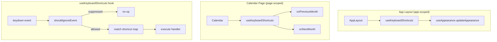

# Design Document: Keyboard Shortcuts

## Overview

This feature adds keyboard shortcuts to the application at two scopes: page-level (arrow keys for calendar month navigation) and app-wide (the "D" key for toggling light/dark appearance). A shared `useKeyboardShortcuts` hook encapsulates all shortcut dispatch logic, including modifier key exclusion and text-input suppression. No backend changes are required — all logic lives in React hooks and components.

### Design Decisions

1. **Single reusable hook** — A `useKeyboardShortcuts` hook accepts a shortcut map and handles event binding, suppression checks, and cleanup. This avoids duplicating guard logic across consumers.
2. **Two consumption sites** — The calendar page registers arrow key handlers (page-scoped, mount/unmount with the page). The app layout registers the "D" key handler (app-scoped, always mounted on authenticated pages).
3. **Guard-first architecture** — The hook checks suppression conditions (modifiers, text inputs) before evaluating the shortcut map. This makes the guards testable as a pure function independent of React.
4. **Delegate to existing functions** — Arrow key handlers call the existing `onPreviousMonth` / `onNextMonth` functions which already enforce boundary clamping. The "D" handler calls `updateAppearance` from the existing `useAppearance` hook.

## Architecture



### Event Flow

1. A `keydown` event fires on `document`.
2. `shouldIgnoreEvent(event)` checks: any modifier key pressed → ignore. Active element is a text input → ignore.
3. If not ignored, the event's `key` is looked up in the registered shortcut map.
4. If a match is found, the handler is invoked and `event.preventDefault()` is called.

## Components and Interfaces

### `useKeyboardShortcuts` Hook

**File:** `resources/js/hooks/use-keyboard-shortcuts.ts`

```typescript
type ShortcutMap = Record<string, () => void>;

function useKeyboardShortcuts(shortcuts: ShortcutMap): void;
```

- Registers a single `keydown` listener on `document` during mount.
- Removes the listener on unmount.
- Uses the latest `shortcuts` map via a ref to avoid stale closures.
- Calls `shouldIgnoreEvent` before dispatching.

### `shouldIgnoreEvent` (Pure Function)

**File:** `resources/js/hooks/use-keyboard-shortcuts.ts` (exported for testing)

```typescript
function shouldIgnoreEvent(event: KeyboardEvent): boolean;
```

Returns `true` if:
- `event.ctrlKey`, `event.metaKey`, `event.altKey`, or `event.shiftKey` is `true`.
- `document.activeElement` is an `<input>` with a text-accepting type, a `<textarea>`, a `<select>`, or has `contenteditable="true"`.

### Calendar Page Integration

**File:** `resources/js/pages/calendar.tsx`

Calls `useKeyboardShortcuts` with:
```typescript
useKeyboardShortcuts({
    ArrowLeft: onPreviousMonth,
    ArrowRight: onNextMonth,
});
```

### App Layout Integration

**File:** `resources/js/layouts/app-layout.tsx`

Calls `useKeyboardShortcuts` with:
```typescript
const { appearance, updateAppearance } = useAppearance();

useKeyboardShortcuts({
    d: () => updateAppearance(appearance === 'light' ? 'dark' : 'light'),
    D: () => updateAppearance(appearance === 'light' ? 'dark' : 'light'),
});
```

> Note: Since Shift is excluded by modifier guards, the `D` (uppercase) entry is unreachable in practice. Both entries are registered for clarity and case-insensitivity documentation, but the modifier guard ensures only lowercase `d` (no modifiers) triggers.

**Revised approach:** Since Shift is blocked, we only need to match on the `event.key` value `"d"`. The hook normalizes `event.key` to lowercase before lookup. This satisfies the "case-insensitive" requirement without needing Shift.

### `isTextInputElement` (Pure Function)

**File:** `resources/js/hooks/use-keyboard-shortcuts.ts` (exported for testing)

```typescript
function isTextInputElement(element: Element | null): boolean;
```

Returns `true` if the element:
- Is an `<input>` with type in: `text`, `search`, `url`, `tel`, `email`, `password`, `number`, `date`, `datetime-local`, `month`, `week`, `time`.
- Is a `<textarea>`.
- Is a `<select>`.
- Has attribute `contenteditable="true"`.

## Data Models

No new data models are introduced. This feature is purely client-side and operates on existing state:

- **Appearance state** — managed by the existing `useAppearance` hook (persisted to localStorage and cookie).
- **Calendar state** — managed by existing `useState` hooks in `calendar.tsx` (`displayedYear`, `displayedMonth`).


## Correctness Properties

*A property is a characteristic or behavior that should hold true across all valid executions of a system — essentially, a formal statement about what the system should do. Properties serve as the bridge between human-readable specifications and machine-verifiable correctness guarantees.*

### Property 1: Text-input element suppression

*For any* keyboard event and *for any* active element that is a text-input element (an `<input>` with a text-accepting type, a `<textarea>`, a `<select>`, or an element with `contenteditable="true"`), `shouldIgnoreEvent` SHALL return `true`, preventing any registered shortcut from firing.

**Validates: Requirements 3.1, 3.2, 3.3, 3.4**

### Property 2: Non-text-input elements allow shortcuts

*For any* keyboard event with no modifier keys pressed and *for any* active element that is NOT a text-input element (e.g., `<div>`, `<span>`, `<body>`, `<button>`, `null`), `shouldIgnoreEvent` SHALL return `false`, allowing the shortcut map to be evaluated.

**Validates: Requirements 3.5**

### Property 3: Modifier key suppression

*For any* keyboard event where at least one modifier key (`ctrlKey`, `metaKey`, `altKey`, or `shiftKey`) is `true`, `shouldIgnoreEvent` SHALL return `true` regardless of the key pressed or the active element.

**Validates: Requirements 4.1, 4.2, 4.3, 4.4**

### Property 4: No-modifier events are evaluated

*For any* keyboard event where all modifier keys are `false` and the active element is not a text-input element, `shouldIgnoreEvent` SHALL return `false`, allowing the shortcut to be dispatched.

**Validates: Requirements 4.5**

## Error Handling

This feature has minimal error surface since it's entirely client-side event handling:

| Scenario | Handling |
|----------|----------|
| `document.activeElement` is `null` | Treat as non-text-input (shortcuts fire) |
| Shortcut key not found in map | No-op — event is not prevented |
| `useAppearance` hook unavailable | Would cause a React error in app layout; not a shortcut-specific concern |
| Multiple instances of the hook | Each instance registers its own listener; no conflicts since they share the same guard logic |

No user-facing error states or notifications are needed. Keyboard shortcuts either fire silently or are suppressed silently.

## Testing Strategy

### Property-Based Tests (Vitest + fast-check)

The `shouldIgnoreEvent` function is a pure function that takes a keyboard event and returns a boolean. This makes it ideal for property-based testing — we can generate arbitrary combinations of modifiers, keys, and active elements.

**Library:** `fast-check` (already installed at v4.1.1)
**Runner:** Vitest with jsdom environment
**Minimum iterations:** 100 per property

Each property test will:
1. Generate random keyboard events with varying modifier states
2. Generate random active elements of various types
3. Assert the universal property holds across all generated inputs

**Test file:** `resources/js/hooks/__tests__/use-keyboard-shortcuts.property.test.ts`

Property tests to implement:
- **Property 1** — Generate random text-input elements × random keys → assert `shouldIgnoreEvent` returns `true`
- **Property 2** — Generate random non-text elements × random keys (no modifiers) → assert `shouldIgnoreEvent` returns `false`
- **Property 3** — Generate random modifier combinations (at least one true) × random elements × random keys → assert `shouldIgnoreEvent` returns `true`
- **Property 4** — Generate random non-text elements × random keys (all modifiers false) → assert `shouldIgnoreEvent` returns `false`

Tag format: `Feature: keyboard-shortcuts, Property {N}: {title}`

### Unit Tests (Vitest)

Example-based tests for integration behavior:

**Test file:** `resources/js/hooks/__tests__/use-keyboard-shortcuts.test.ts`

- ArrowLeft on calendar page calls `onPreviousMonth`
- ArrowRight on calendar page calls `onNextMonth`
- Listener is removed on component unmount
- Boundary: ArrowLeft at min year does not navigate backward
- Boundary: ArrowRight at max year does not navigate forward
- "d" key toggles appearance from light → dark
- "d" key toggles appearance from dark → light
- "d" key toggles appearance from system → light
- Shortcut does not fire when `<input type="text">` is focused
- Shortcut does not fire when Ctrl+D is pressed

### What Is NOT Property-Tested

- The appearance toggle mapping logic (light→dark, dark/system→light) — only 3 states, covered exhaustively by unit tests
- React hook lifecycle (mount/unmount) — tested with example-based component tests
- Boundary clamping — already tested in `onPreviousMonth`/`onNextMonth`; the shortcut just delegates
